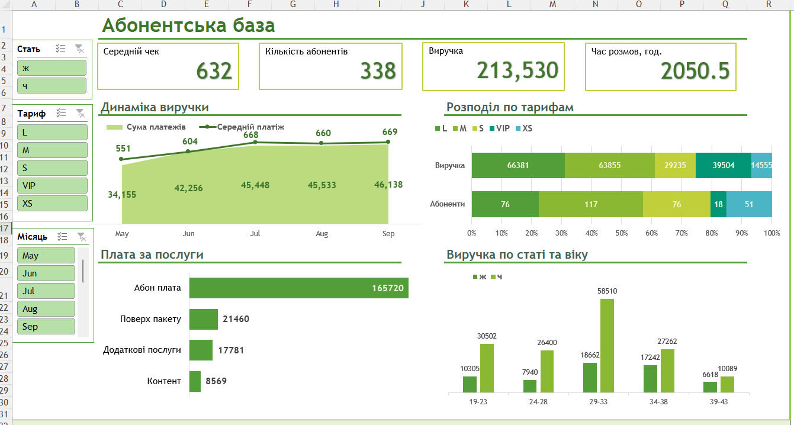

# Пояснювальна записка по проектам для портфоліо

Я сфокусувався на задачах які можуть трапитись мені на робочому місці. Я планую доповнювати даний репозиторій і використовувати його як пам'ятку для реальних задач. 

Список проектів: 
- [RFM_sql_project](RFM-аналіз_аптеки.pdf) - аналіз клієнтської бази аптечної мережі на SQL. 
- [Дашборд в Excel](Аналіз_абонентів.xlsx) - Дашборд аналізу абонентів оператора зв'язку в Excel
  

- [Дашборд Power BI](SalesDashboardContoso.pbix) - продажі компанії Contoso в Power BI + декілка варіантів оформлення візуалів
  

- [ABC-XYZ аналіз на Python.](ABC_XYZ.ipynb)
- [Аналіз окупаємості маркетингових інвестицій ROMI на Python.](LTV_CAC.ipynb)
- [EDA на Python.](taxy_EDA.ipynb) - Дослідницький аналіз часу заправок автомобілів.
- [Вплив на продажі маркетингових активностей в мережі магазинів на Python.(Eng)](marketing_impact.ipynb) 
- [Загальний аналіз продажів групи товарів на Python.(Eng)](quantium.ipynb) + [в форматі pdf](quantium.pdf)

**Запропонувати мені роботу: zzabaras@gmail.com**

# public_projects
